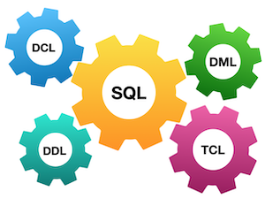

# День 00 - Писцин SQL

## _Реляционная модель данных и SQL_

Резюме: Сегодня вы узнаете, как работает реляционная модель и как получать необходимые данные, используя базовые конструкции SQL.

## Содержание

1. [Глава I](#глава-i) \
    1.1. [Введение](#введение)
2. [Глава II](#глава-ii) \
    2.1. [Общие правила](#общие-правила)
3. [Глава III](#глава-iii) \
    3.1. [Правила дня](#правила-дня)  
4. [Глава IV](#глава-iv) \
    4.1. [Упражнение 00 - Первые шаги в мире SQL](#упражнение-00-первые-шаги-в-мире-sql)  
5. [Глава V](#глава-v) \
    5.1. [Упражнение 01 - Первые шаги в мире SQL](#упражнение-01-первые-шаги-в-мире-sql)  
6. [Глава VI](#глава-vi) \
    6.1. [Упражнение 02 - Первые шаги в мире SQL](#упражнение-02-первые-шаги-в-мире-sql)  
7. [Глава VII](#глава-vii) \
    7.1. [Упражнение 03 - Первые шаги в мире SQL](#упражнение-03-первые-шаги-в-мире-sql)  
8. [Глава VIII](#глава-viii) \
    8.1. [Упражнение 04 - Первые шаги в мире SQL](#упражнение-04-первые-шаги-в-мире-sql)
9. [Глава IX](#глава-ix) \
    9.1. [Упражнение 05 - Первые шаги в мире SQL](#упражнение-05-первые-шаги-в-мире-sql)
10. [Глава X](#глава-x) \
    10.1. [Упражнение 06 - Первые шаги в мире SQL](#упражнение-06-первые-шаги-в-мире-sql)
11. [Глава XI](#глава-xi) \
    11.1. [Упражнение 07 - Первые шаги в мире SQL](#упражнение-07-первые-шаги-в-мире-sql)
12. [Глава XII](#глава-xii) \
    12.1. [Упражнение 08 - Первые шаги в мире SQL](#упражнение-08-первые-шаги-в-мире-sql)
13. [Глава XIII](#глава-xiii) \
    13.1. [Упражнение 09 - Первые шаги в мире SQL](#упражнение-09-первые-шаги-в-мире-sql)

## Глава I
## Введение

Стандарты существуют везде, и реляционные базы данных тоже подчиняются им :-). По правде говоря, в начале 2000-х годов стандарты SQL были гораздо строже. Когда появился паттерн «Big Data», реляционные базы данных нашли свой способ реализовать этот подход, и поэтому современные стандарты стали более... гибкими.

Пожалуйста, ознакомьтесь с некоторыми стандартами SQL ниже и попробуйте задуматься о будущем реляционных баз данных.

|  |  |
| ------ | ------ |
|  |  |
|  |  |
|  |  |

## Глава II
## Общие правила

- Используйте эту страницу как единственный источник информации. Не доверяйте слухам и спекуляциям о том, как готовить решение.
- Убедитесь, что вы используете последнюю версию PostgreSQL.
- Допускается использование IDE для написания исходного кода (SQL-скрипта).
- Для проверки ваше решение должно быть в вашем GIT-репозитории.
- Ваши решения будут оцениваться вашими сокурсниками.
- В вашей директории не должно быть других файлов, кроме явно указанных в условиях задания. Рекомендуется настроить `.gitignore`, чтобы избежать случайностей.
- Есть вопрос? Спросите соседа справа. Если не помог — попробуйте спросить слева.
- Ваши справочники: сокурсники / Интернет / Google.
- Внимательно читайте примеры. В них могут быть требования, не указанные явно в задании.
- И пусть SQL-Сила будет с вами!
- Абсолютно всё можно выразить на SQL! Давайте начнём и получим удовольствие!

## Глава III
## Правила дня

- Убедитесь, что у вас есть собственная база данных и доступ к ней в вашем кластере PostgreSQL.
- Пожалуйста, скачайте [скрипт](materials/model.sql) с моделью базы данных и примените его к своей базе (можно через psql в командной строке или через любую IDE, например DataGrip от JetBrains или pgAdmin от сообщества PostgreSQL).
- Все задания содержат разделы «Разрешено» и «Запрещено» с перечислением допустимых и недопустимых опций, типов данных, SQL-конструкций и т.д. Ознакомьтесь с ними перед началом работы.
- Ознакомьтесь с логической схемой нашей базы данных.

1. Таблица **pizzeria** (Справочник доступных пиццерий)
   - поле id — первичный ключ
   - поле name — название пиццерии
   - поле rating — средний рейтинг пиццерии (от 0 до 5 баллов)
2. Таблица **person** (Справочник людей, любящих пиццу)
   - поле id — первичный ключ
   - поле name — имя человека
   - поле age — возраст
   - поле gender — пол
   - поле address — адрес
3. Таблица **menu** (Справочник меню и цен на конкретную пиццу)
   - поле id — первичный ключ
   - поле pizzeria_id — внешний ключ на пиццерию
   - поле pizza_name — название пиццы в пиццерии
   - поле price — цена конкретной пиццы
4. Таблица **person_visits** (Операционная таблица с информацией о посещениях пиццерий)
   - поле id — первичный ключ
   - поле person_id — внешний ключ на person
   - поле pizzeria_id — внешний ключ на pizzeria
   - поле visit_date — дата (например, 2022-01-01) посещения
5. Таблица **person_order** (Операционная таблица с информацией о заказах)
   - поле id — первичный ключ
   - поле person_id — внешний ключ на person
   - поле menu_id — внешний ключ на menu
   - поле order_date — дата (например, 2022-01-01) заказа

Посещение и заказ — разные сущности и не связаны между собой. Например, клиент может находиться в одном ресторане (просто смотреть меню), а в это время сделать заказ в другом по телефону или через приложение. Или, например, быть дома и сделать заказ без посещения.

## Глава IV
## Упражнение 00 - Первые шаги в мире SQL

| Упражнение 00: Первые шаги в мире SQL |                                                                                                                          |
|---------------------------------------|--------------------------------------------------------------------------------------------------------------------------|
| Каталог для сдачи                     | ex00                                                                                                                     |
| Файлы для сдачи                       | `day00_ex00.sql`                                                                                 |
| **Разрешено**                        |                                                                                                                          |
| Язык                                  | ANSI SQL                                                                                              |

Давайте выполним первое задание.
Пожалуйста, напишите SELECT-запрос, который возвращает имена и возраст всех людей из города «Казань».

## Глава V
## Упражнение 01 - Первые шаги в мире SQL

| Упражнение 01: Первые шаги в мире SQL |                                                                                                                          |
|---------------------------------------|--------------------------------------------------------------------------------------------------------------------------|
| Каталог для сдачи                     | ex01                                                                                                                     |
| Файлы для сдачи                       | `day00_ex01.sql`                                                                                 |
| **Разрешено**                        |                                                                                                                          |
| Язык                                  | ANSI SQL                                                                                              |

Пожалуйста, напишите SELECT-запрос, который возвращает имена и возраст всех женщин из города «Казань». Да, и отсортируйте результат по имени.

## Глава VI
## Упражнение 02 - Первые шаги в мире SQL

| Упражнение 02: Первые шаги в мире SQL |                                                                                                                          |
|---------------------------------------|--------------------------------------------------------------------------------------------------------------------------|
| Каталог для сдачи                     | ex02                                                                                                                     |
| Файлы для сдачи                       | `day00_ex02.sql`                                                                                 |
| **Разрешено**                        |                                                                                                                          |
| Язык                                  | ANSI SQL                                                                                              |

Пожалуйста, напишите два разных по синтаксису SELECT-запроса, которые возвращают список пиццерий (название и рейтинг) с рейтингом от 3.5 до 5 баллов (включительно), отсортированных по рейтингу.
- Первый запрос должен использовать знаки сравнения (<=, >=)
- Второй запрос должен использовать ключевое слово `BETWEEN`

## Глава VII
## Упражнение 03 - Первые шаги в мире SQL

| Упражнение 03: Первые шаги в мире SQL |                                                                                                                          |
|---------------------------------------|--------------------------------------------------------------------------------------------------------------------------|
| Каталог для сдачи                     | ex03                                                                                                                     |
| Файлы для сдачи                       | `day00_ex03.sql`                                                                                 |
| **Разрешено**                        |                                                                                                                          |
| Язык                                  | ANSI SQL                                                                                              |

Пожалуйста, напишите SELECT-запрос, который возвращает идентификаторы людей (без повторов), посетивших пиццерии в период с 6 по 9 января 2022 года (включительно) или посетивших пиццерию с идентификатором 2. Также добавьте сортировку по идентификатору человека в порядке убывания.

## Глава VIII
## Упражнение 04 - Первые шаги в мире SQL

| Упражнение 04: Первые шаги в мире SQL |                                                                                                                          |
|---------------------------------------|--------------------------------------------------------------------------------------------------------------------------|
| Каталог для сдачи                     | ex04                                                                                                                     |
| Файлы для сдачи                       | `day00_ex04.sql`                                                                                 |
| **Разрешено**                        |                                                                                                                          |
| Язык                                  | ANSI SQL                                                                                              |

Пожалуйста, напишите SELECT-запрос, который возвращает вычисляемое поле с именем ‘person_information’ в виде строки, как в примере ниже:

`Anna (age:16,gender:'female',address:'Moscow')`

В конце добавьте сортировку по вычисляемому столбцу в порядке возрастания.
Обратите внимание на кавычки в формуле!

## Глава IX
## Упражнение 05 - Первые шаги в мире SQL

| Упражнение 05: Первые шаги в мире SQL |                                                                                                                          |
|---------------------------------------|--------------------------------------------------------------------------------------------------------------------------|
| Каталог для сдачи                     | ex05                                                                                                                     |
| Файлы для сдачи                       | `day00_ex05.sql`                                                                                 |
| **Разрешено**                        |                                                                                                                          |
| Язык                                  | ANSI SQL                                                                                              |
| **Запрещено**                        |                                            
| SQL-конструкции                      | `IN`, любые типы `JOIN`                                                                                              |

Пожалуйста, напишите SELECT-запрос, который возвращает имена людей (на основе внутреннего запроса в SELECT) и даты заказов для меню с идентификаторами 13, 14 и 18, при этом дата заказа должна быть 7 января 2022 года. Обратите внимание на раздел «Запрещено».

Посмотрите на пример внутреннего запроса:

    SELECT 
        (SELECT ... ) AS NAME  -- это внутренний запрос в основном SELECT
    FROM ...
    WHERE ...

## Глава X
## Упражнение 06 - Первые шаги в мире SQL

| Упражнение 06: Первые шаги в мире SQL |                                                                                                                          |
|---------------------------------------|--------------------------------------------------------------------------------------------------------------------------|
| Каталог для сдачи                     | ex06                                                                                                                     |
| Файлы для сдачи                       | `day00_ex06.sql`                                                                                 |
| **Разрешено**                        |                                                                                                                          |
| Язык                                  | ANSI SQL                                                                                              |
| **Запрещено**                        |                                            
| SQL-конструкции                      | `IN`, любые типы `JOIN`                                                                                              |

Используйте SQL-конструкцию из упражнения 05 и добавьте новый вычисляемый столбец (назовите его ‘check_name’) с проверкой по следующему псевдокоду:

    if (person_name == 'Denis') then return true
        else return false

## Глава XI
## Упражнение 07 - Первые шаги в мире SQL

| Упражнение 07: Первые шаги в мире SQL |                                                                                                                          |
|---------------------------------------|--------------------------------------------------------------------------------------------------------------------------|
| Каталог для сдачи                     | ex07                                                                                                                     |
| Файлы для сдачи                       | `day00_ex07.sql`                                                                                 |
| **Разрешено**                        |                                                                                                                          |
| Язык                                  | ANSI SQL                                                                                              |

Давайте применим интервалы возраста для таблицы `person`.
Пожалуйста, напишите SQL-запрос, который возвращает идентификаторы, имена и интервал возраста (новый вычисляемый столбец ‘interval_info’) по следующему псевдокоду:

    if (age >= 10 and age <= 20) then return 'interval #1'
    else if (age > 20 and age < 24) then return 'interval #2'
    else return 'interval #3'

И да... отсортируйте результат по столбцу ‘interval_info’ в порядке возрастания.

## Глава XII
## Упражнение 08 - Первые шаги в мире SQL

| Упражнение 08: Первые шаги в мире SQL |                                                                                                                          |
|---------------------------------------|--------------------------------------------------------------------------------------------------------------------------|
| Каталог для сдачи                     | ex08                                                                                                                     |
| Файлы для сдачи                       | `day00_ex08.sql`                                                                                 |
| **Разрешено**                        |                                                                                                                          |
| Язык                                  | ANSI SQL                                                                                              |

Пожалуйста, напишите SQL-запрос, который возвращает все столбцы из таблицы `person_order` для строк, идентификатор которых — чётное число. Результат должен быть отсортирован по идентификатору.

## Глава XIII
## Упражнение 09 - Первые шаги в мире SQL

| Упражнение 09: Первые шаги в мире SQL |                                                                                                                          |
|---------------------------------------|--------------------------------------------------------------------------------------------------------------------------|
| Каталог для сдачи                     | ex09                                                                                                                     |
| Файлы для сдачи                       | `day00_ex09.sql`                                                                                 |
| **Разрешено**                        |                                                                                                                          |
| Язык                                  | ANSI SQL                                                                                              |
| **Запрещено**                        |                                            
| SQL-конструкции                      | любые типы `JOIN`                                                                                              |

Пожалуйста, напишите SELECT-запрос, который возвращает имена людей и названия пиццерий на основе таблицы `person_visits` для посещений в период с 7 по 9 января 2022 года (включительно) (используйте внутренний запрос в FROM).

Посмотрите на пример итогового запроса:

    SELECT (...) AS person_name ,  -- это внутренний запрос в основном SELECT
            (...) AS pizzeria_name  -- это внутренний запрос в основном SELECT
    FROM (SELECT … FROM person_visits WHERE …) AS pv -- это внутренний запрос в FROM
    ORDER BY ...

Добавьте сортировку по имени человека по возрастанию и по названию пиццерии по убыванию. 